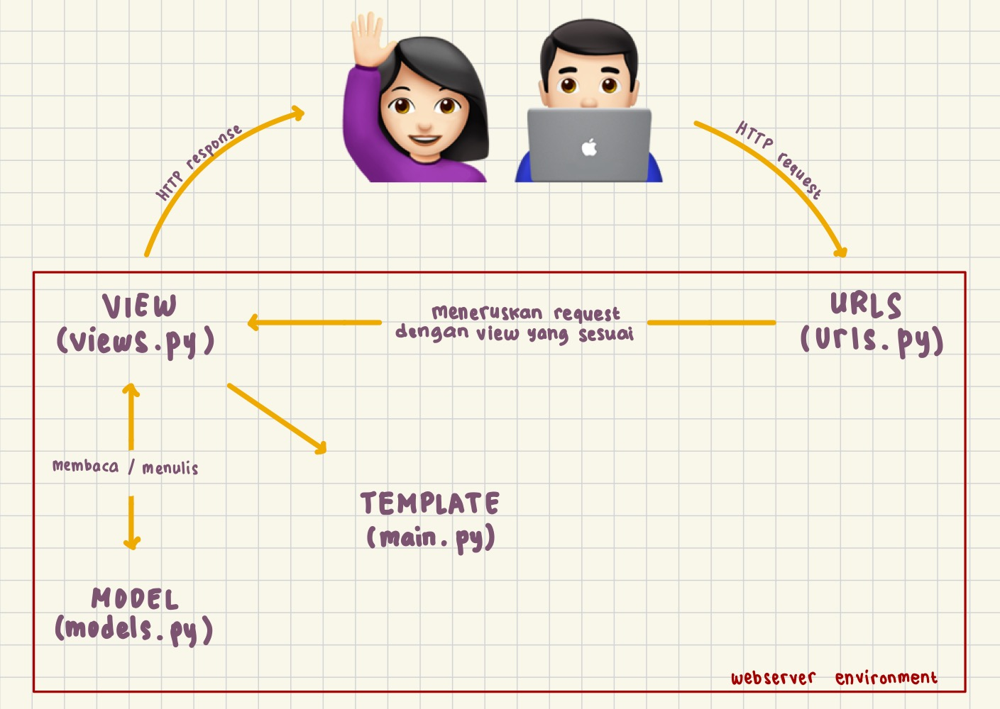
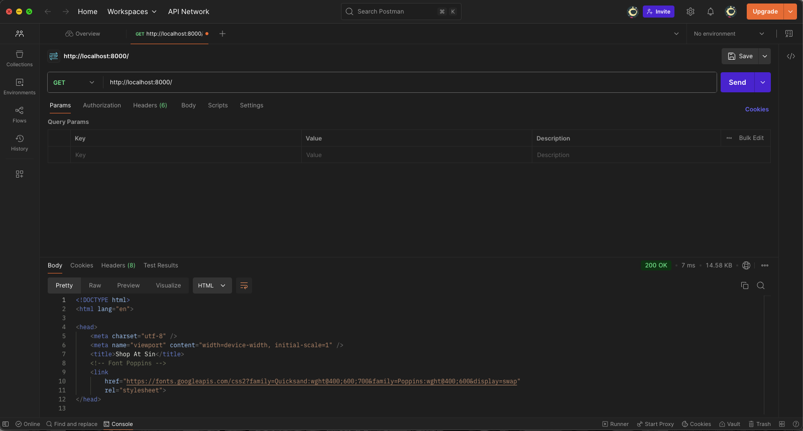
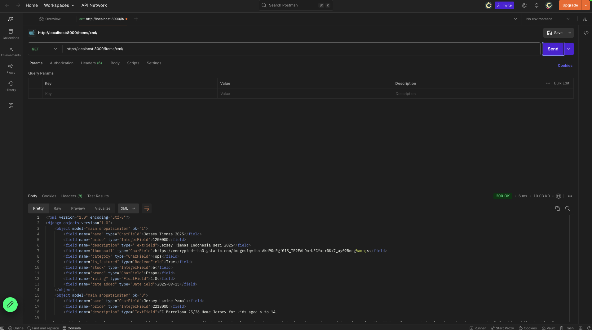
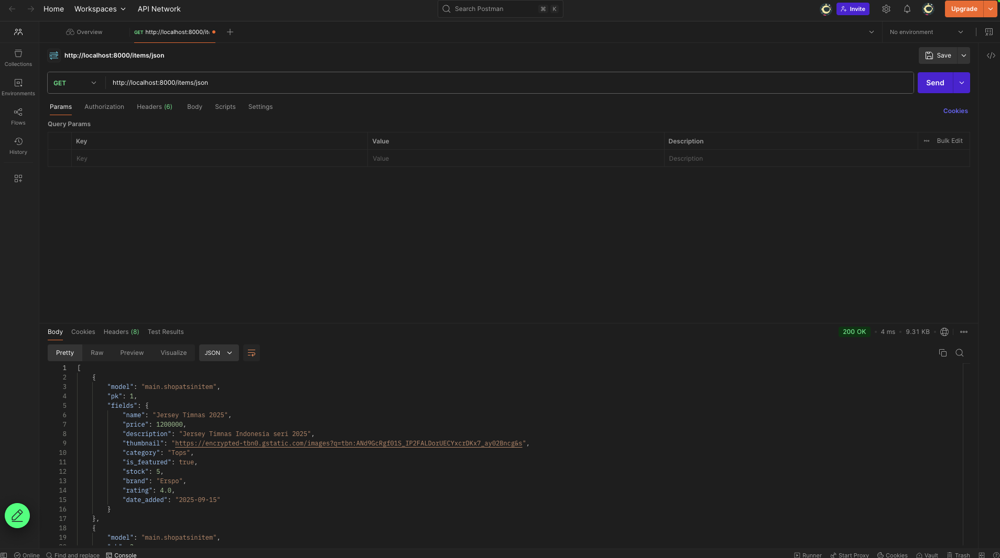
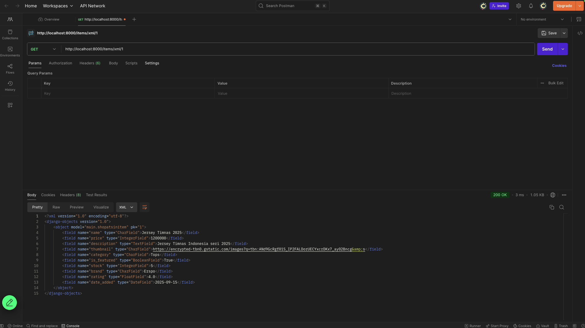
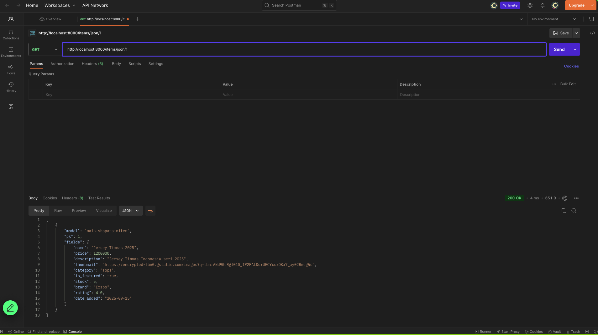

# ShopAtSin

**Tugas Pemrograman Berbasis Platform - PBP F**

> **ShopAtSin** merupakan proyek Django sederhana berbentuk e-commerce football shop berbasis website untuk memenuhi Tugas Individu mata kuliah PBP Gasal 2025/2026

[ ⚽️ Kunjungi Website ShopAtSin at (link) ]

## **Penjelasan Tugas**

<details>
<summary> <b> Tugas 2: Implementasi Model-View-Template (MVT) pada Django </b> </summary>

## **Implementasi Checklist**

* ### Inisiasi Proyek Django

Setelah saya membuat direktori baru dengan nama ShopAtSin, nama toko saya, saya membuat dependencies pada berkas 'requirements.txt' yang berisi

```
django
gunicorn
whitenoise
psycopg2-binary
requests
urllib3
```

Lalu melakukan instalasi dependencies setelah menjalankan virtual environment dengan perintah `pip install -r requirements.txt` dan membuat proyek Django dengan perintah `django-admin startproject shopatsin .`

* ### Menjalankan Server

Setelah membuat proyek Django, saya menambahkan string `ALLOWED_HOSTS = ["localhost", "127.0.0.1"]` untuk keperluan deployment dan menjalankan server Django dengan perintah `python3 manage.py runserver`

* ### Membuat  aplikasi `main`

Saya menjalankan perintah `python manage.py startapp main` untuk membuat aplikasi baru bernama main. Lalu saya menambahkan `main` ke `INSTALLED_APPS` pada berkas `settings.py` 


* ### Membuat model aplikasi `main`

Saya membuat berkas `models.py` pada direktori `main` yang berisikan

```
from django.db import models

class ItemInShopAtSin(models.Model):
    name = models.CharField(max_length=255) 
    price = models.IntegerField()  
    description = models.TextField()  
    thumbnail = models.URLField()  
    is_featured = models.BooleanField(default=False)  

    stock = models.IntegerField(default=0)  
    brand = models.CharField(max_length=100, blank=True, null=True)  
    rating = models.FloatField(default=0.0)  
    date_added = models.DateField(auto_now_add=True) 

    def __str__(self):
        return f"{self.name} - {self.category}"
```

Lalu saya mengimigrasikan model yang sudah saya buat dengan menjalankan perintah `python3 manage.py makemigrations` dan mengimigrasikannya ke basis data lokal dengan menjalankan perintah `python manage.py migrate`

* ### Membuat template dan view aplikasi `main`

Template untuk merender pada file `views.py` berisikan

```
from django.shortcuts import render

def show_main(request):
    context = {
        "app_name": "ShopAtSin",              
        "student_name": "Annisa Muthia Alfahira",  
        "student_class": "F"   
    }
    return render(request, "main.html", context)

```

dan template pada file `html.main` berisi 

```
<!DOCTYPE html>
<html lang="en">
<head>
    <meta charset="UTF-8">
    <title>{{ app_name }}</title>
</head>
<body>
    <h1>Welcome to {{ app_name }} 👋</h1>
    <p>Nama: {{ student_name }}</p>
    <p>Kelas: {{ student_class }}</p>
</body>
</html>

```

* ### Melakukan routing pada aplikasi `main`

Untuk mengatur URL pada aplikasi `main`, saya membuat berkas `urls.py` pada aplikasi `main` berisikan

```
from django.urls import path
from .views import show_main

app_name = 'main'

urlpatterns = [
    path('', show_main, name='show_main'),
]
```

Dengan begitu, saya dapat melihat `main` dengan perintah `python manage.py runserver`

## **Jawaban Tugas 2**

* ### Bagan request client ke web aplikasi berbasis Django



Client (Browser/User) mengirimkan request HTTP ke server, kemudian memprosesnya dengan melakukan pemetaan URL melalui `urls.py`. Setelah URL ditemukan dan dipetakan, fungsi yang sesuai dalam `views.py` dijalankan berdasarkan permintaan URL tersebut. Selanjutnya, fungsi view mengembalikan HTTP response dalam bentuk halaman HTML. Dalam proses ini, `views.py` mengambil data yang dibutuhkan dari `models.py`, lalu data tersebut disajikan menggunakan template main.html.


* ### Jelaskan peran `settings.py` dalam project Django!

File `settings.py` dalam proyek Django berfungsi sebagai pusat konfigurasi yang mengatur bagaimana aplikasi berjalan. Semua pengaturan inti, mulai dari aplikasi apa saja yang digunakan, koneksi ke database, hingga lokasi template HTML dan file statis seperti CSS atau JavaScript, didefinisikan di dalamnya. Selain itu, `settings.py` juga memuat pengaturan keamanan, misalnya `SECRET_KEY` untuk enkripsi, `DEBUG` untuk menentukan mode pengembangan atau produksi, serta `ALLOWED_HOSTS` yang menentukan domain mana saja yang diperbolehkan mengakses aplikasi. Tidak hanya itu, file ini juga mengatur bahasa, zona waktu, serta berbagai middleware yang akan memproses request dan response. Dengan kata lain, `settings.py` adalah jantung dari proyek Django, karena tanpa file ini server tidak akan tahu bagaimana cara menjalankan dan mengatur seluruh komponen aplikasi.

* ### Bagaimana cara kerja migrasi database di Django?

Migrasi database di Django adalah proses untuk menerjemahkan perubahan yang dibuat pada model Python menjadi perubahan pada struktur tabel di database. Saat seorang pengembang menambahkan, mengubah, atau menghapus atribut pada sebuah model di `models.py`, Django tidak langsung mengubah database, melainkan menyimpan perubahan itu sebagai berkas migrasi dengan perintah `python manage.py makemigrations`. Berkas migrasi ini berisi instruksi yang mendeskripsikan apa saja perubahan yang perlu dilakukan pada database. Setelah itu, perintah `python manage.py migrate` dijalankan untuk mengeksekusi instruksi tersebut sehingga database diperbarui sesuai dengan definisi model terbaru. Dengan sistem migrasi ini, pengembang dapat melacak riwayat perubahan database, berpindah antar versi struktur tabel, serta menjaga konsistensi antara kode program dengan basis data yang digunakan.

* ### Menurut Anda, dari semua framework yang ada, mengapa framework Django dijadikan permulaan pembelajaran pengembangan perangkat lunak?

Django sering dijadikan permulaan dalam pembelajaran pengembangan perangkat lunak karena sifatnya yang lengkap, terstruktur, dan begineer friendly. Framework ini menganut prinsip “batteries included”, artinya banyak fitur penting seperti autentikasi pengguna, manajemen database, sistem template, hingga pengaturan keamanan sudah tersedia secara bawaan tanpa harus menambahkan modul tambahan. Hal ini membuat mahasiswa atau pengembang pemula bisa lebih fokus memahami konsep dasar pengembangan aplikasi web daripada pusing pada detail teknis kecil. Selain itu, Django menggunakan bahasa Python yang dikenal dengan sintaks yang sederhana dan mudah dibaca, sehingga membantu pemula untuk cepat memahami logika program. Struktur proyek Django yang rapi juga memperkenalkan mahasiswa pada praktik best practice dalam pengembangan perangkat lunak, seperti pemisahan model, view, dan template. Dengan kombinasi kemudahan penggunaan dan kelengkapan fitur, Django menjadi pilihan yang ideal sebagai titik awal sebelum mempelajari framework lain yang mungkin lebih kompleks.

* ### Apakah ada feedback untuk asisten dosen tutorial 1 yang telah kamu kerjakan sebelumnya?

Tidak ada, all good!!

</details>

<details>
<summary> <b> Tugas 3: Implementasi Form dan Data Delivery pada Django </b> </summary>

> ### **Jelaskan mengapa kita memerlukan data delivery dalam pengimplementasian sebuah platform?**

Data delivery” = cara data diambil/dikirim antar komponen (frontend ↔ backend ↔ layanan lain) secara terstruktur, aman, efisien, dan konsisten. Tanpa desain data delivery yang jelas, platform bakal cepat berantakan. Alasan utamanya:

* Interoperabilitas: client berbeda (web, mobile, service lain) bisa ngomong ke server dengan format & protokol yang sama (mis. HTTP + JSON).
* Pemecahan tanggung jawab (decoupling): UI bisa berkembang tanpa merombak backend, asal kontrak API dan format data terjaga.
* Reliabilitas & skalabilitas: dukung retry, idempotency, pagination, caching (ETag/Last-Modified), rate limiting.
* Keamanan: kanal terenkripsi (HTTPS), auth (token/session), kontrol akses, audit logging.
* Kinerja: format data yang ringan, kompresi, dan kemampuan streaming/batching.
* Observabilitas: payload seragam memudahkan logging, tracing, dan analitik.
* Contoh konkret di platform Django: endpoint REST (JSON) untuk CRUD, Webhook/Queue untuk event, dan mekanisme cache untuk response read-heavy.

> ### **Menurutmu, mana yang lebih baik antara XML dan JSON? Mengapa JSON lebih populer dibandingkan XML?**

tergantung use case, tapi JSON lebih populer di web modern.

### Kelebihan JSON
* Lebih ringkas & mudah dibaca (lebih sedikit “tag” daripada XML).
* Mapping natural ke struktur data bahasa modern (object/dict, array, number, bool).
* Native di JavaScript (JSON.parse/stringify) → ideal untuk SPA/Frontend.
* Parsing cepat dan dukungan luas di semua framework web.

### Kelebihan XML (tetap relevan di domain tertentu)
* Schema & validasi kuat (XSD), namespaces, mixed content (teks + markup) → unggul untuk dokumen kompleks, standar enterprise lama, atau dunia publishing.
* Atribut & extensibility yang rapi di beberapa protokol lama (SOAP).

### Kesimpulan:
* App web/mobile modern → JSON (ringan, cepat, tooling melimpah).
* Integrasi enterprise legacy / dokumen kompleks / perlu XSD → XML masih masuk akal.

> ### **Fungsi `is_valid()` pada Django Form**
`form.is_valid()` menjalankan validasi penuh form:
* Memicu `full_clean()` → mem-parse `request.POST/FILES`, menjalankan validasi built-in, custom clean_<field>(), dan clean() level form.
* Mengisi `form.cleaned_data` (data yang sudah dibersihkan/ditipkan tipe).
* Mengisi `form.errors` jika ada error.
* Return `True/False`: hanya gunakan `cleaned_data/form.save()` (ModelForm) setelah `is_valid()` bernilai `True`.

> ### **Mengapa kita membutuhkan `csrf_token` saat membuat form di Django? Apa yang dapat terjadi jika kita tidak menambahkan `csrf_token` pada form Django? Bagaimana hal tersebut dapat dimanfaatkan oleh penyerang?**
CSRF (Cross-Site Request Forgery) = serangan di mana attacker “menyuruh” browser korban mengirimkan POST/PUT/DELETE ke situs menggunakan cookie sesi korban tanpa sepengetahuan korban (contoh:  auto-submit form tersembunyi dari domain jahat).

Django memakai CSRF token (random per user/session) yang:
* Diset sebagai cookie;
* Wajib dikirim balik di hidden field `` (atau header untuk AJAX).
* Diverifikasi middleware → request dari situs lain tanpa token valid akan ditolak.

Kalau tidak pakai `csrf_token`:
* Attacker bisa “mengklikkan” aksi penting (ubah password, transfer saldo, hapus data, posting spam) pada akun korban karena cookie login korban otomatis ikut pada request lintas-site.
* Di deployment custom domain, ingat juga set `CSRF_TRUSTED_ORIGINS` kalau domainnya beda dari asal (ini yang sering bikin error “Origin checking failed” saat live).

Contoh setting (di `settings.py`):

### Tambahkan domain HTTPS yang sah saat deploy:
```
CSRF_TRUSTED_ORIGINS = [
    "https://annisa-muthia-shopatsin.pbp.cs.ui.ac.id",
]
```
> ### **Apakah ada feedback untuk asdos di tutorial 2 yang sudah kalian kerjakan?**
Nope, all good!

> ### **Jelaskan bagaimana cara kamu mengimplementasikan checklist di atas secara step-by-step (bukan hanya sekadar mengikuti tutorial)**
Untuk mendapatkan data baru yang ingin ditampilkan, maka dapat dibuat `form` untuk menerima input.

1. Pertama, buat berkas baru bernama `forms.py` pada direktori `main` dan tambahkan kode berikut ini.

```python
from django.forms import ModelForm
from main.models import ShopAtSinItem

class ItemsForms(ModelForm):
    class Meta:
        model = ShopAtSinItem
        fields = ["name", "price", "description", "thumbnail", "category", "is_featured", "stock", "brand", "rating"]
```

2. Kedua, mengubah fungsi `show_main` pada `views.py` dengan kode berikut ini.
```python
def show_main(request):
    items = ShopAtSinItem.objects.all()

    context = {
        "app_name": "ShopAtSin",              
        "student_name": "Annisa Muthia Alfahira",  
        "student_class": "F"   ,
        'items': items
    }

    return render(request, "main.html", context)
```

### Menambahkan fungsi pada `views`
Kita akan bisa melihat dan mengembalikan data yang telah dimasukkan melalui `form`. 

#### Format HTML

1. Akan dibuat fungsi baru bernama `create_item` pada `views.py`, untuk menerima data seperti pada kode berikut ini.
```python
def create_item(request):
    form = ItemsForms(request.POST or None)

    if form.is_valid() and request.method == "POST":
        form.save()
        return redirect('main:show_main')

    context = {'form': form}
    return render(request, "create_item.html", context)
```

2. Membuat *template* baru untuk tampilan dalam menambahkan *item* baru dengan nama `create_item.html` pada direktori `main/templates`.
```python
<h1>Add New Item</h1>

<form method="post">
  
  {{ form.as_p }}
  <button type="submit">Save</button>
</form>

<p><a href=""><button>Back</button></a></p>

```

3. Tampilkan data *item* dalam bentuk tabel dan tambahkan tombol `+ Add Item` pada `main.html`.
```python
    <a href="" style="
    text-decoration:none; display:inline-flex; align-items:center; gap:8px;
    padding:10px 16px; border-radius:22px; font-weight:700;
    color:#fff; background:#f2769b;
    box-shadow:0 6px 16px rgba(0,0,0,.15);
  ">
    <span style="font-size:1.1rem;">＋</span> Add Item
  </a>
```

---

Untuk format XML dan JSON, saya akan menambahkan *import* `HttpResponse` dan `serializers` pada `views.py` di folder `main`.

#### Format XML
Tambahkan fungsi `show_xml` yang me-return `HttpResponse` berisi data yang sudah di-serialize menjadi XML.

```python
def show_xml(request):
    data = ShopAtSinItem.objects.all()
    xml = serializers.serialize("xml", data)
    return HttpResponse(xml, content_type="application/xml")
```

#### Format JSON
Tambahkan fungsi `show_json` yang me-return `HttpResponse` berisi data yang sudah di-serialize menjadi JSON.

```python
def show_json(request):
    data = ShopAtSinItem.objects.all()
    js = serializers.serialize("json", data)
    return HttpResponse(js, content_type="application/json")
```

---

Untuk format XML dan JSON *by* ID, dalam pengambilan hasil *query* tambahkan *filter* dengan ID tertentu saja.

#### Format XML *by* ID
```python
def show_xml_by_id(request, id):
    obj = get_object_or_404(ShopAtSinItem, pk=id)
    xml = serializers.serialize("xml", [obj]) 
    return HttpResponse(xml, content_type="application/xml")
```

#### Format JSON *by* ID
```python
def show_json_by_id(request, id):
    obj = get_object_or_404(ShopAtSinItem, pk=id)
    js = serializers.serialize("json", [obj])
    return HttpResponse(js, content_type="application/json")
```
---

### Membuat *routing* URL
Tambahkan path url fungsi diatas ke dalam `urlpatterns` pada `urls.py` di folder `main`. Tidak lupa untuk mengimportnya dari `views.py`.

```python
from django.urls import path
from .views import show_main, show_item, create_item, show_xml, show_json, show_xml_by_id, show_json_by_id

app_name = 'main'

urlpatterns = [
    path('', show_main, name='show_main'),
    path('items/<int:id>/', show_item, name='show_item'),
    path('items/create/', create_item, name='create_item'),
    path('items/xml/', show_xml, name='show_xml'),
    path('items/json/', show_json, name='show_json'),
    path('items/xml/<str:id>/', show_xml_by_id, name='show_xml_by_id'),
    path('items/json/<str:id>/', show_json_by_id, name='show_json_by_id'),
]
```

Dengan begitu, input `form` sudah selesai dibuat dan siap digunakan. Jalankan command `python manage.py runserver` dan kunjungi <http://localhost:8000>.

## Postman *Screenshot*
Berikut adalah tangkapan layar hasil akses URL melalui Postman untuk tiap kelima URL.
1. HTML

2. XML

3. JSON

4. XML *by* ID

5. JSON *by* ID



</details>

<details>
<summary> <b> Tugas 4: Implementasi Autentikasi, Session, dan Cookies pada Django </b> </summary>

## **Jawaban Tugas 4**

> ### Apa itu Django AuthenticationForm? Kelebihan dan Kekurangannya

Django AuthenticationForm adalah form bawaan Django yang digunakan untuk menangani proses login user dengan field username dan password. Form ini secara otomatis memvalidasi apakah kombinasi username dan password sesuai dengan data di database menggunakan sistem autentikasi Django. 

Kelebihannya adalah praktis dan aman karena sudah mengintegrasikan logika autentikasi bawaan, sehingga developer tidak perlu membuat logika verifikasi sendiri. Namun, kekurangannya adalah terbatas dalam kustomisasi, jika ingin menambahkan field tambahan seperti “remember me” atau integrasi OTP, biasanya developer perlu menulis form kustom.

> ### Perbedaan Autentikasi dan Otorisasi, serta Implementasi di Django
Autentikasi adalah proses untuk memastikan identitas pengguna—misalnya dengan username dan password—sedangkan otorisasi adalah proses untuk menentukan apa yang boleh dilakukan pengguna tersebut setelah terautentikasi, seperti apakah bisa mengakses halaman admin atau hanya halaman biasa.  

Django memisahkan keduanya dengan jelas. Autentikasi ditangani lewat `authenticate()` dan `login()`, sedangkan otorisasi diatur dengan sistem permission, group, serta flag seperti `is_staff` dan `is_superuser`. Django juga menyediakan dekorator seperti `@login_required` dan `@permission_required` untuk membatasi akses ke view tertentu sesuai hak pengguna.

> ### Kelebihan dan Kekurangan Session dan Cookies
Session menyimpan data di server, sementara browser hanya menyimpan ID sesi di cookie. Kelebihannya adalah data sensitif lebih aman karena tidak dikirim ke browser, serta mampu menyimpan struktur data kompleks. Kekurangannya adalah membebani server karena semua state disimpan di sisi server.

Cookies menyimpan data langsung di browser. Kelebihannya adalah ringan, mudah digunakan, dan cocok untuk preferensi user yang tidak sensitif. Namun, kekurangannya adalah rentan terhadap manipulasi atau pencurian data jika tidak diamankan dengan baik, serta terbatas ukurannya (umumnya 4KB per cookie).

> ### Apakah Cookies Aman Secara Default? Bagaimana Django Menangani?
Cookies tidak selalu aman secara default karena bisa dicuri melalui serangan seperti XSS atau dikirim tanpa enkripsi pada koneksi HTTP. Karena itu, ada risiko potensial jika developer tidak berhati-hati.  

Django membantu mengurangi risiko ini dengan beberapa pengaturan:  
- `SESSION_COOKIE_SECURE = True` untuk memastikan cookie hanya dikirim lewat HTTPS.  
- `SESSION_COOKIE_HTTPONLY = True` agar cookie tidak bisa diakses lewat JavaScript.  
- `CSRF_COOKIE_SECURE` dan `CSRF_COOKIE_HTTPONLY` untuk melindungi CSRF token.  
- Middleware CSRF yang mewajibkan token unik di setiap form POST.  
Dengan kombinasi ini, Django memberi dasar keamanan yang cukup kuat dalam penggunaan cookies.

### Implementasi Step-by-Step

## Implementasi Autentikasi, Session, dan Cookies

### Membuat Fungsi dan Form Registrasi
Pada tugas kali ini, kita ingin membuat halaman utama kita hanya bisa diakses oleh pengguna yang sudah mempunyai akun saja. Untuk mendaftarkan pengguna, diperlukan form registrasi.

Pada `views.py` folder main, saya menambahkan fungsi `register` dan mengimport beberapa modul berikut ini.
```python
from django.shortcuts import redirect
from django.contrib.auth.forms import UserCreationForm
from django.contrib import messages  

def register(request):
    form = UserCreationForm()
    if request.method == "POST":
        form = UserCreationForm(request.POST)
        if form.is_valid():
            form.save()
            messages.success(request, 'Your account has been successfully created!')
            return redirect('main:login')
    context = {'form': form}
    return render(request, 'register.html', context)
```
Setelah itu, saya membuat halaman registrasi `register.html` pada `main/templates` dengan kode berikut.
```html



<title>Register</title>




<div>
  <h1>Register</h1>

  <form method="POST">
    
    <table>
      {{ form.as_table }}
      <tr>
        <td></td>
        <td><input type="submit" name="submit" value="Daftar" /></td>
      </tr>
    </table>
  </form>

  
  <ul>
    
    <li>{{ message }}</li>
    
  </ul>
  
</div>


```
Terakhir, menambahkan *url path* pada `urls.py`.

```python
from main.views import register

urlpatterns = [
    ...
    path('register/', register, name='register'),
    ...
]
```

### Membuat Fungsi Login dan Merestriksi Akses Halaman Main
Setelah membuat form registrasi, saya membuat fitur login untuk mengakses pengguna yang terdaftar.

Pada `views.py` folder main, saya menambahkan fungsi `login_user` dan mengimport beberapa modul berikut ini.
```python
from django.contrib.auth import authenticate, login

def login_user(request):
   if request.method == 'POST':
      form = AuthenticationForm(data=request.POST)

      if form.is_valid():
            user = form.get_user()
            login(request, user)
            return redirect('main:show_main')

   else:
      form = AuthenticationForm(request)
   context = {'form': form}
   return render(request, 'login.html', context)
```
Setelah itu, saya membuat halaman login `login.html` pada `main/templates` dengan kode berikut.

```html



<title>Login</title>



<div class="login">
  <h1>Login</h1>

  <form method="POST" action="">
    
    <table>
      {{ form.as_table }}
      <tr>
        <td></td>
        <td><input class="btn login_btn" type="submit" value="Login" /></td>
      </tr>
    </table>
  </form>

  
  <ul>
    
    <li>{{ message }}</li>
    
  </ul>
   Don't have an account yet?
  <a href="">Register Now</a>
</div>


</div>


```
Terakhir, menambahkan *url path* pada `urls.py`.
```python
from main.views import login_user

urlpatterns = [
    ...
    path('login/', login_user, name='login'),
    ...
]
```

Untuk membatasi akses halaman main, pada `views.py` tambahkan modul dan decorator berikut ini.
```python
from django.contrib.auth.decorators import login_required

@login_required(login_url='/login') 
def show_main(request):
    ....

@login_required(login_url='/login')
def create_item(request):
    ....
```

### Membuat Fungsi Logout
Sekrang pengguna sudah berhasil melakukan login. Lalu, bagaimana dengan fitur logout?

Pada `views.py` folder main, saya menambahkan fungsi `logout_user` dan mengimport beberapa modul berikut ini.
```python
from django.contrib.auth import logout

def logout_user(request):
    logout(request)
    response = HttpResponseRedirect(reverse('main:login'))
    response.delete_cookie('last_login')
    return response
```
Setelah itu, saya membuat tombol `"logout"` di `base.html` pada `templates` dengan kode berikut.
```html
    ...
     <a href="" >
            <button>
                Logout
            </button>
        </a>
    ...
```
Terakhir, menambahkan *url path* pada `urls.py`.
```python
from main.views import logout_user

urlpatterns = [
    ...
    path('logout/', logout_user, name='logout'),
    ...
]
```

### Menghubungkan `Item` dengan `User`
Agar pengguna yang terotorisasi dapat melihat produk-produknya sendiri, kita perlu menghubungkan setiap objek `Item` untuk setiap `User`.
Saya menambahkan kode berikut pada `models.py`,
```python
from django.contrib.auth.models import User

class Item(models.Model):
    ...
    user = models.ForeignKey(User, on_delete=models.CASCADE)
```

Saya juga mengubah sedikit kode pada fungsi `create_item` di `views.py` menjadi seperti berikut.
```python
@login_required(login_url='/login')
def create_item(request):
    form = ItemsForms(request.POST or None)

    if form.is_valid() and request.method == "POST":
        item = form.save(commit=False)
        item.user = request.user
        item.save()
        return redirect("main:show_main")

    context = {"form": form}
    return render(request, "create_item.html", context)
```
Terakhir, agar nama penggunanya berubah tambahkan kode berikut pada fungsi `show_main`.
```python
def show_main(request):
    filter_type = request.GET.get('filter', 'all')

    if filter_type == 'all':
        items = ShopAtSinItem.objects.all()
    else:
        # contoh: ?filter=my  -> hanya item milik user login
        items = ShopAtSinItem.objects.filter(user=request.user)

    context = {
        "app_name": "ShopAtSin",
        "student_name": "Annisa Muthia Alfahira",
        "student_class": "F",
        "items": items,
        "last_login": request.COOKIES.get('last_login', 'Never'),
        "filter_type": filter_type,  # optional: bisa dipakai buat highlight tombol filter
    }
    return render(request, "main.html", context)
```
Simpan perubahan tersebut dan jangan lupa untuk melakukan `python manage.py makemigrations` dan `python manage.py migrate`.

### Menerapkan Cookies
Untuk menampilkan data *last login* pengguna, kita bisa menggunakan cookies.

Saya menambahkan modul berikut pada `views.py` direktori `main`. 
```python
import datetime
from django.http import HttpResponseRedirect
from django.urls import reverse
```

Tambahkan informasi cookie *last login* pada fungsi `show_main`.
```python
context = {
        ...
        "last_login": request.COOKIES.get('last_login', 'Never'),  
        ...
    }
```
Ubahlah kode `logout_user` menjadi seperti berikut.
```python
def logout_user(request):
    logout(request)
    response = HttpResponseRedirect(reverse('main:login'))
    response.delete_cookie('last_login')
    return response
```
Terakhir, tampilkan cookie nya ke dalam `base.html`.
```html
...
<h5>Sesi terakhir login: {{ last_login }}</h5>
...
```
</details>